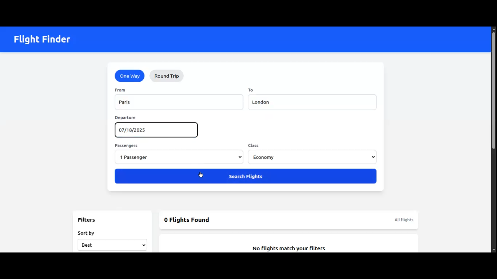

# ✈️ Flights Guide

A full-featured clone of Google Flights, built to provide a seamless flight search experience with real-time results, filtering, and intuitive UI/UX. This project is designed to mimic the core functionalities of Google Flights, including searching, selecting, and filtering flights between destinations.

🌟 Features
🔍 Flight Search Engine: Search for flights based on origin, destination, and travel dates.

📅 Date Picker: Intuitive calendar UI to pick departure and return dates.

🛫 Multi-city & One-way Options (optional enhancement).

💵 Price Sorting & Filters: Sort by price, airline, stops, and more.

🌐 Responsive Design: Fully mobile-friendly interface.

🚀 Real-time Search Simulation: Smooth loading and mock API integration.

# 🎥 Demo Video

🚀 Getting Started
1. Clone the repository
bash
Copy
Edit
git clone [https://github.com/yourusername/google-flights-clone.git](https://github.com/Geze296/Flight-Guide.git)
cd google-flights-clone
2. Install dependencies
bash
Copy
Edit
npm install
3. Run the app
bash
Copy
Edit
npm run dev
